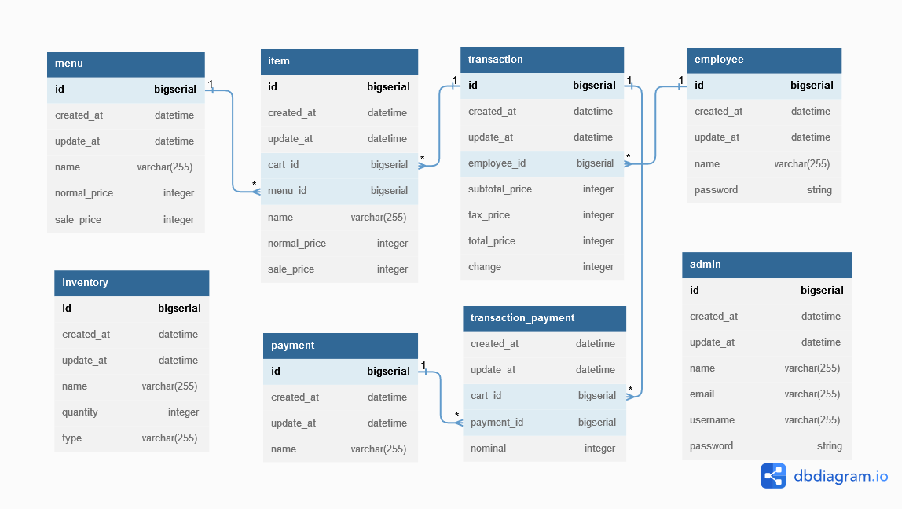

# Aplikasi Rumah Makan

Needs

- Aplikasi ini bisa memasukkan pesanan-pesanan makanan pelanggan
- Aplikasi ini bisa mengeluarkan struk pembelian
- Aplikasi ini bisa mengeluarkan laporan penghasilan mingguan dan bulanan
- Aplikasi ini bisa mengeluarkan laporan stok

## Rancangan Database

## Tech Stacks

Teknologi sendiri, diantaranya

- Backend: Spring Frameworks (Spring Web, Spring Data JPA, Spring Security), MySQL
- Client: JavaFX (Desktop App)
- Web: NextJS, React, Redux, Typescript

Pemilihan terknologi tersebut seperti Spring Frameworks sendiri dikarenakan itu dapat membantu kita untuk membangun applikasi dengan cepat tanpa perlu menghawatirkan untuk menulis kode panjang lebar sehingga kita bisa menghemat waktu dan tenaga.

Disisi lain, Pemilihan JavaFX sebagai applikasi destop dikarenakan kita bisa membuat applikasi secara multi platform baik di Windows/Linux/MacOS (Write Once, Run Everywhere). Dan juga itu dapat mendukung untuk mencetak struk pembelian baik itu JavaPOS/ESCPOS.

Untuk web sendiri yang mana digunakan sebagai dashboard, kita dapat menggunakan ReactJS selain karena populer, dukungan komunitas dan dokumentasi juga cukup memadai.

Nah, untuk kemanan disini ada `employee` yang mana bertugas sebagi operator mesin kasir, cukup masukan `employee_id & password` untuk login mesin kasir, sehingga tak sembarang orang dapat mengoperasikannya. Sedangkan `admin` dapat login di dashboard web menggunakan `email/username & password` untuk melihat laporan, seperti stok inventory atau laporan penhasilan.
